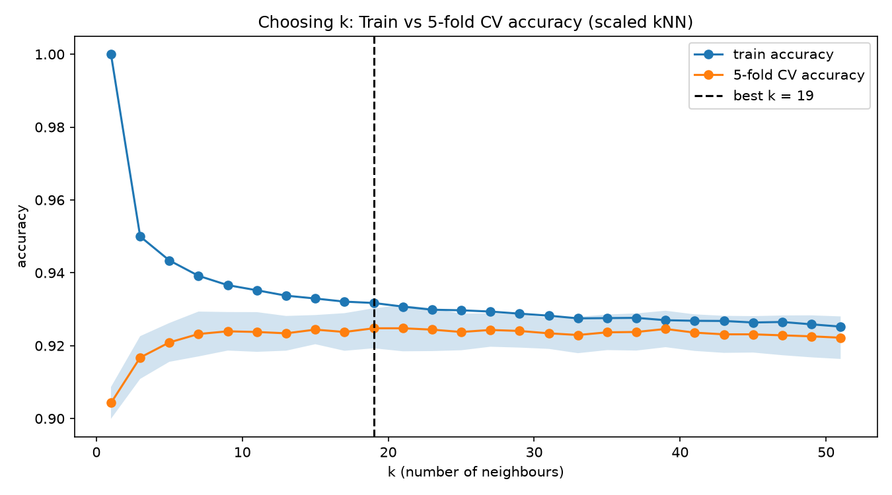
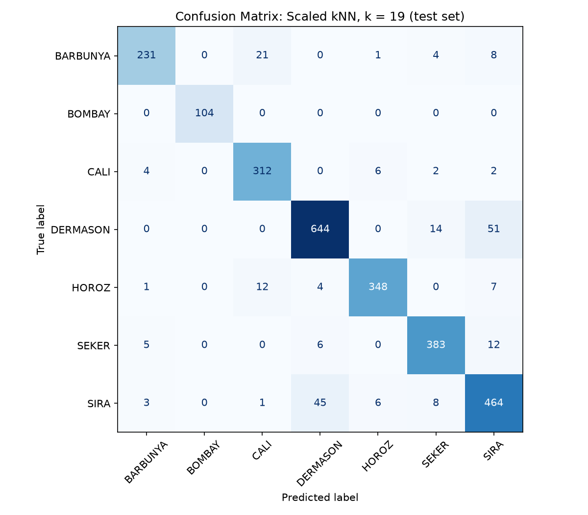

### Title:

KNN on Dry Beans: Scaling, k and look-alike classes
*The look-alike classes SIRA & DERMASON caused 43% of the total errors*

---

### Question:

KNN classifies by distance calculated between query point and the neighbouring points in the training dataset. What happens if these features sit on scales 100 million times apart? How should k be chosen? Where did the remaining errors came from?

---

### All about dataset:

1. Dataset chosen: **UCI Dry Bean dataset** containing *13,611 beans* and *16 shape features* from images and its 7 varieties.
2. Citation: Koklu, M. & Ozkan, I.A. (2020). Dry Bean Dataset. UCI Machine Learning Repository. https://doi.org/10.24432/C50S4B, CC BY 4.0
3. Cleaning: In total 68 duplicate rows were dropped and all of them were HOROZ.
4. Classes were unequal: DERMASON with 3,456 vs BOMBAY with 522.
5. Split: Stratified 80/20 train-test split, **random state = 42** meaning 10,834 in training and rest 2,709 in testing.

---

### Method:

1. Pipeline: The ML pipeline was made using scaler and KNN with scaler being fitted in the training dataset only.
2. Scaling comparison was done k = 5.
3. The value of k was chosen between 1 and 51 (odd) with 5-fold stratified CV.
4. The final model was thus, evaluated on testing dataset.
5. At last, Per-class report and confusion matrix were generated to obtain the results.

---

### Results:

| Setup (k = 5) | Accuracy | Macro F1 |
|--|--|--|
| Unscaled, all 16 | 0.7305 | 0.7311 |
| Unscaled, 6 size features only | 0.7305 | 0.7311 |
| StandardScaler, all 16 | 0.9155 | 0.9270 |
| MinMaxSaler, all 16 | 0.9125 | 0.9258 |

1. Rows 1 and 2 were identical to each other as Area (20k - 255k) swamps the shape features (< 1) in the distance.
2. The value of k matters in the low end, not at the high end.

k = 1 overfits (train 1.000 vs CV 0.904), CV is flat when k was in between 1 and 41. The value of k = 19 was only best ny 0.001 against the fold noise of ~0.005.
3. Errors come back from look-alike classes and not by the rare ones.

With the help of this figure, BOMBAY = 104/104 (which was the rarest class), SIRA & DERMASON accounts for 96 out of 223 errors (43%), meanwhile BARBUNYA & CALI was one-directional with 21 vs 4.

Final test score: **Accuracy = 0.918**, **Macro F1 = 0.929** at k = 19.

---

### Conclusions:

1. Unscaled KNN ignores the features which are identical to each other.
2. Optimal value of k must be chosen in order to avoid underfitting and overfitting.
3. Look-alike classes must be resolved in order to avoid errors.

---

### Limitations:

1. A single train/test split.
2. Only KNN was tried here, model which weights features by itself like tree must seperate SIRA & DERMASON better.
3. The duplicates were dropped, hence, weren't investigated. This is why HOROZ is unknown.
4. Features were scaled instead of being selected as several of them were near-duplicates of each other.

---

### How to run?

```venv
pip install -r requirements.txt
python -m src.load_data
python -m src.preprocess
python -m src.scaling_experiment
python -m src.choose_k
python -m src.evaluate_classes
```

---

### Project Structure:

```
├── dataset/
│   ├── raw/
│   │   └── Dry_Bean_Dataset.xlsx     # original UCI file
│   └── processed/
│       ├── train.csv                 # 10,834 rows, stratified 80%
│       └── test.csv                  # 2,709 rows, stratified 20%
├── reports/
│   └── figures/
│       ├── k_selection.png           # train vs CV accuracy across k
│       └── confusion_matrix.png      # per-class errors on the test set
├── src/
│   ├── load_data.py                  # load xlsx, inspect classes and feature scales
│   ├── preprocess.py                 # drop 68 duplicates, stratified split
│   ├── scaling_experiment.py         # unscaled vs StandardScaler vs MinMaxScaler
│   ├── choose_k.py                   # 5-fold stratified CV over k = 1..51
│   └── evaluate_classes.py           # classification report + confusion matrix
├── requirements.txt
└── README.md
```

---
